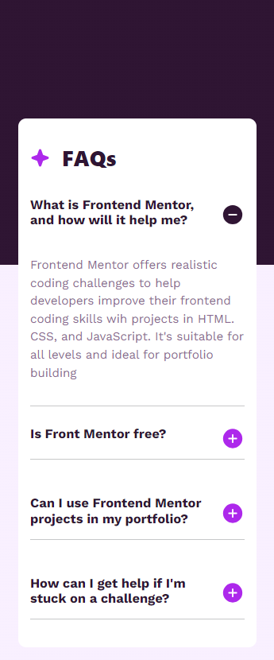

# Frontend Mentor - FAQ accordion solution
## Table of contents

  - [Overview](#overview)
  - [The challenge](#the-challenge)
  - [Screenshot](#screenshot)
  - [Links](#links)
  - [My process](#my-process)
  - [Built with](#built-with)
  - [What I learned](#what-i-learned)
 
  # Links

## Overview

This is a FAQ simple project to improve my javaScript skills.

## The challenge

Users should be able to:

- Hide/Show the answer to a question when the question is clicked
- Navigate the questions and hide/show answers using keyboard navigation alone
- View the optimal layout for the interface depending on their device's screen size
- 
## Screenshot

## Built with

- Semantic HTML5 markup
- CSS custom properties
- Flexbox
- Mobile-first workflow -
- [Bootstrap](https://getbootstrap.com/docs/5.3/getting-started/introduction/)
- [javaScript](https://developer.mozilla.org/en-US/docs/Learn/JavaScript)

## What I learned

I learned how to implement logic inside of eventListener in javaScript, also I learned how to use bootstrap classes in concordance with CSS. I improved my knowledge on how to use better responsive design, accessability and CEO.
